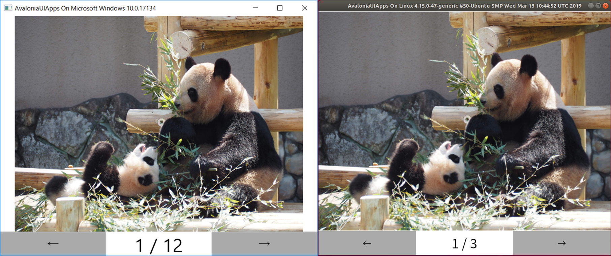

# AvaloniaPictureViewer

## 概要
- Avaloniaのデモ目的です
- カレントディレクトリに配置された`image`フォルダ内のjpgファイルを順番に表示します
- ウインドウタイトルに、アプリを起動しているOSの名前を表示します

## 開発環境
- Windows10 Home 1803
- Visual Studio 2019 Community Edition

## Used OSS
すべてNuget経由で取得。

- [Avalonia](https://github.com/AvaloniaUI/Avalonia/blob/master/licence.md)
  - Copyright (c) 2014 Steven Kirk
- [Prism](https://github.com/PrismLibrary/Prism/blob/master/LICENSE)
  - Copyright (c) .NET Foundation
- [NaturalSort.Extension](https://raw.githubusercontent.com/tompazourek/NaturalSort.Extension/master/LICENSE)
  - Copyright (c) 2017 Tomáš Pažourek
- [ReactiveProperty](https://github.com/runceel/ReactiveProperty/blob/master/LICENSE.txt)
  - Copyright (c) 2018 neuecc, xin9le, okazuki
